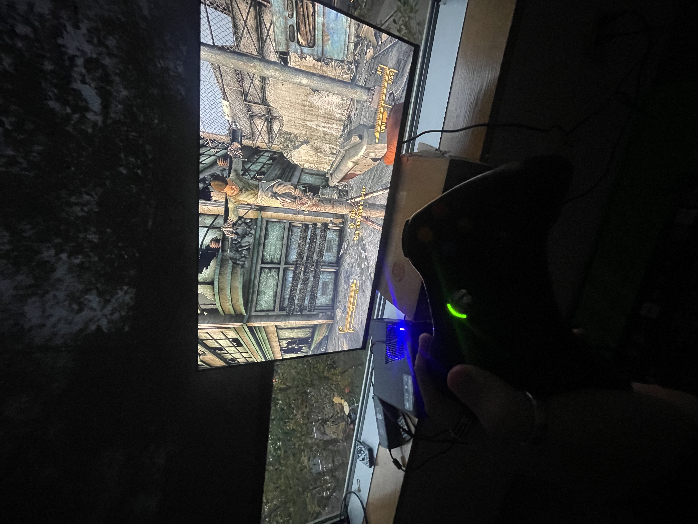
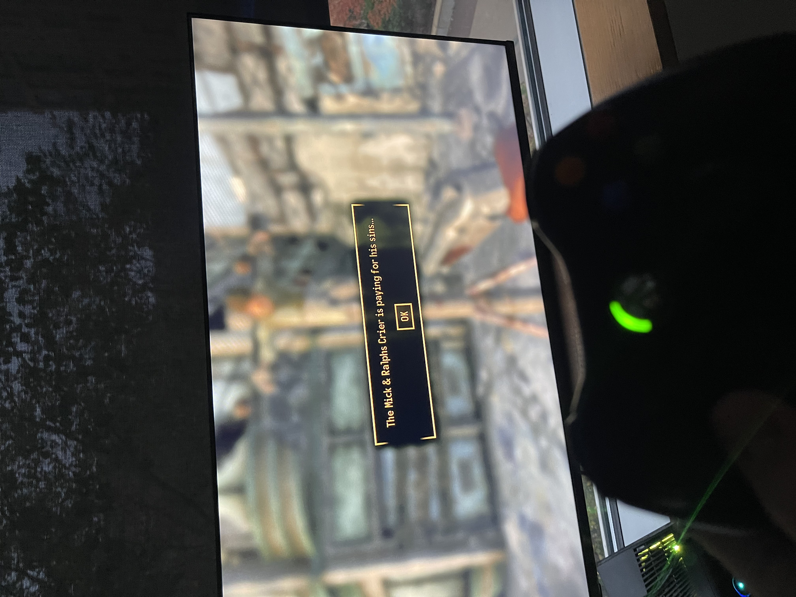
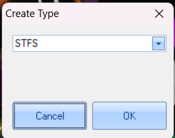
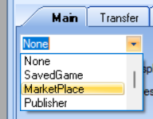
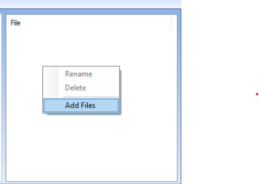
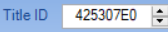
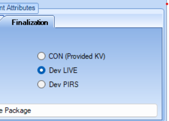
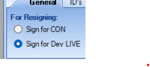

# Fallout: New Vegas — Xbox 360 Converted Mods (RGH/JTAG)

Converted Fallout: New Vegas mods repacked as LIVE DLC for **RGH/JTAG Xbox 360 consoles**.  
Each mod is NVSE-free and packaged with Le Fluffie using **STFS → Marketplace → Title ID `425307E0`**.

Maintained by **@frankischilling**.

---

## What This Repo Is For

- Preserve simple, fun New Vegas mods that **do not require NVSE**
- Make them installable on **real Xbox 360 hardware**
- Avoid PC-only scripting or patching each time

All mods here are plug-and-play: drop them on the console and enable in **Downloadable Content**.

---

## Installation (Xbox 360 RGH/JTAG)

1. Download a `.LIVE` mod file from `mods/`  
2. Transfer it to:
```

/Hdd1/Content/0000000000000000/425307E0/00000002/

```
3. Reboot your console  
4. Launch Fallout: New Vegas → open **Downloadable Content**  
5. Enable the mod  
6. Start a **new save** for best stability

---

## Converted Mods Included (So far!)

| Mod Name | Author | Description | Status |
|----------|--------|-------------|--------|
| **MnRKid — ThatModTeam** | ThatModTeam | Adds the Mick and Ralf's kid being crucified (finally he shuts up!). No NVSE, lightweight, and stable for console. | ✅ Working (tested on RGH) |

More mods will be added as they are successfully converted and tested.

---

## In-Game Screenshots





---

## Tools & Downloads

- **Le Fluffie (STFS/Marketplace packager)** — used to build `.LIVE` DLC packages  
**Download:** https://archive.org/details/le-fluffie  
> After building, go to **Security → Sign for Dev Live**. Do **not** Rebuild again after signing.

*(Optional, for audio mods)*  
- **WAV → XMA/XWM converter** (if a mod includes `.wav` sounds)  
https://www.nexusmods.com/skyrim/mods/32075

---

## Visual Tutorial (Le Fluffie → STFS → Marketplace)

1. Open Le Fluffie and select STFS



2. Choose Marketplace content type



3. Add your mod files



4. Set Title ID to 425307E0



5. Security → Sign for Dev Live



6. Confirm signature completed



---

## ⚙️ Conversion Method Used

- Extract assets (no `.bsa` — unpack to loose files)
- Validate `.esp` / `.esm` (NVSE-free only)
- Ensure textures are `.dds` (DXT1/3/5); convert if needed
- Package with **Le Fluffie → STFS → Marketplace**
- Title ID: `425307E0`
- Content Type: `00000002`
- **Security → Sign for Dev Live**
- Deploy and test on actual RGH hardware

---

## Repository Structure

```

nv360-mods/
├── mods/                 # Ready-to-install .LIVE packages
│     └── MnRKid-thatmodteam.LIVE
├── ingame-screenshots/   # In-game previews
├── tut/                  # Le Fluffie step-by-step screenshots
├── tools/
│     └── LeFluffie-link.txt   # mirrors/notes if needed
└── README.md

```

---

## ⚠️ Note / Disclaimer

- All original credit belongs to the **original Nexus mod authors**
- This repository hosts **Xbox-ready conversions** only
- Redistribution is for preservation & educational purposes — not for resale
- If any author requests removal of their work, it will be taken down

---

## Issues / Requests

If a mod crashes or doesn’t appear in the DLC list, open a GitHub Issue with:
- Console type (RGH/JTAG)
- Mod name
- Game edition (Standard/Ultimate)
- Steps to reproduce

You can also request NVSE-free Nexus mods to be converted.

---

Maintained by **@frankischilling**

If you want, I can also drop a tiny `tools/LeFluffie-link.txt` snippet you can commit alongside the README.
